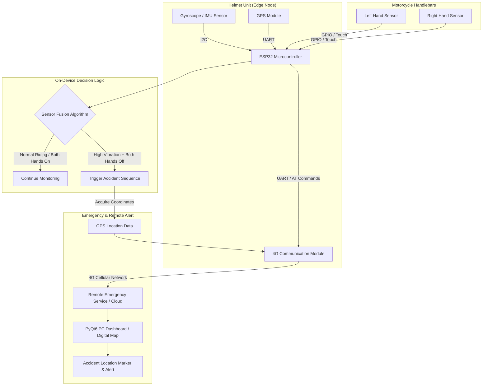
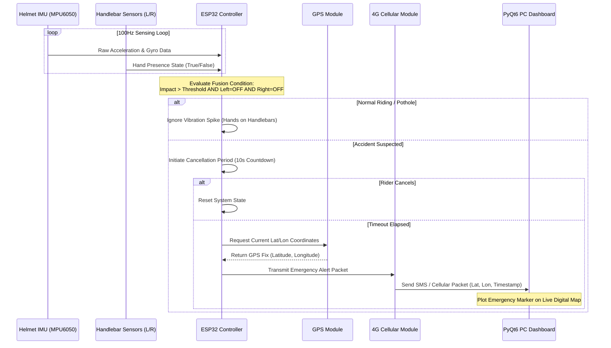
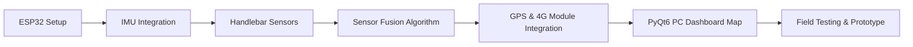

<div align="center">

# 🏍️ YANTRA: Motorcycle Accident Alert System

An intelligent IoT-based motorcycle accident detection and alert system featuring ESP32-S3 edge node processing, multi-sensor fusion (IMU + dual-handlebar hand detection), GPS positioning, 4G cellular transmission, and a real-time PyQt6 PC dashboard.


</div>

---

## 1. Project Overview

**Yantra Accident Alert System** is an end-to-end motorcycle safety and emergency notification solution. Traditional vibration-only accident detection systems suffer from high false-positive rates caused by everyday riding events such as potholes, rough roads, speed bumps, and hard braking. 

Yantra addresses this limitation by introducing a **context-aware sensor fusion mechanism**: combining helmet motion sensing (IMU), dual-hand handlebar detection sensors, GPS location tracking, and 4G cellular emergency communication.

> 📚 **Deep Dive:** For detailed hardware schematics, software design, and experimental test logs, please explore the documentation inside the [`docs/`](file:///d:/Yantra_accident_alert_system/docs) directory.

### System Architecture



### Data Flow



---

## 2. Repository Structure

```text
Yantra_accident_alert_system/
├── firmware/                  # ESP32 Firmware (PlatformIO / Arduino C++)
│   ├── src/                   # Firmware source code (main.cpp)
│   ├── include/               # Header files
│   ├── lib/                   # Custom drivers & libraries
│   ├── test/                  # Unit tests for firmware logic
│   ├── config/                # System hardware pinouts & parameters
│   ├── drivers/               # IMU, GPS, and 4G driver modules
│   └── platformio.ini         # PlatformIO build configuration
├── pc_app/                    # PC Application & Live Dashboard
│   ├── src/                   # Dashboard source code
│   │   ├── ui/                # PyQt6 GUI layout & digital map widgets
│   │   ├── core/              # Accident alert processing & loggers
│   │   ├── utils/             # Helper utilities & data formatters
│   │   └── api/               # Serial / Cellular communication interface
│   ├── assets/                # Icons, logos, and sound effects
│   ├── config/                # Application configuration files
│   ├── docs/                  # Dashboard development notes
│   ├── tests/                 # GUI test suite
│   ├── main.py                # Dashboard entry point
│   └── requirements.txt       # Python dependencies
├── docs/                      # System documentation
│   ├── 01_Project_Overview.md # Detailed project goals & scope
│   ├── 02_Requirements.md     # Hardware & software specs
│   ├── 03_Hardware.md         # Component schematics & pinouts
│   ├── 04_Software.md         # Software architecture & protocols
│   ├── 05_System_Architecture.md # Complete system diagrams
│   ├── 06_Accident_Detection.md  # Algorithm math & fusion logic
│   ├── 07_GPS_and_4G.md       # GPS parsing & 4G AT commands
│   ├── 08_Testing.md          # Experimental test matrices
│   ├── 09_Development_Log.md  # Milestone progress log
│   └── images/                # Diagrams, flowcharts, & screenshots
├── .gitignore                 # Environment ignore patterns
└── README.md                  # Project overview document
```

---

## 3. Hardware Architecture

### 1. ESP32 Microcontroller
The ESP32 acts as the central controller responsible for:
- Reading motion data from the helmet IMU via $I^2C$.
- Polling handlebar left and right hand detection sensors via digital/capacitive GPIO.
- Executing the real-time sensor fusion accident detection algorithm.
- Parsing NMEA sentences from the GPS module over UART.
- Driving the 4G cellular module via AT commands for emergency transmission.

### 2. Helmet Unit
The helmet-mounted unit contains:
- **Gyroscope / IMU (MPU6050/ADXL345)**: Detects high-g impacts and sudden angular rotations.
- **GPS Module**: Obtains high-accuracy geographical coordinates.
- **4G Communication Module**: Sends SMS/cellular emergency alerts to the cloud server and PC app.
- **Power Supply / Battery**: Dedicated rechargeable Li-Po battery pack.

### 3. Handlebar Unit
Two sensors positioned on the motorcycle handlebars:
- **Left-Hand Sensor**: Detects hand contact on the left grip.
- **Right-Hand Sensor**: Detects hand contact on the right grip.
- *Purpose*: Determines whether the rider's hands remain on the handlebars during motion.

---

## 4. Accident Detection Concept

### Core Design Principle
$$\text{Large Vibration Alone } \neq \text{ Accident}$$

Motorcycles experience substantial vibrations during normal operation due to:
- Potholes and road bumps
- Rough / unpaved terrain
- Hard braking or sudden acceleration
- Engine vibrations

Therefore, **Yantra** pairs vibration monitoring with handlebar hand detection to eliminate false alarms:

```text
POTHOLE SCENARIO:
Large Vibration  +  Left Hand ON  +  Right Hand ON  --->  NORMAL RIDING (No Alert)

ACCIDENT SCENARIO:
Large Impact     +  Left Hand OFF +  Right Hand OFF --->  ACCIDENT SUSPECTED (Trigger Alert)
```

---

## 5. Key Terminology & Concepts

### Accelerometer
- **Definition:** Measures proper linear acceleration ($m/s^2$ or $g$).
- **Function:** Detects sudden deceleration or high-g mechanical impact.
- **Conversion:** $1g \approx 9.81 \, m/s^2$.

### Gyroscope
- **Definition:** Measures angular velocity ($rad/s$ or $deg/s$).
- **Function:** Detects sudden rotational movement or helmet tumble.

### GPS (Global Positioning System)
- **Definition:** Satellite navigation system providing geographic coordinates.
- **Output:** Latitude & Longitude in NMEA 0183 standard format (e.g., `6.927079, 79.861244`).

### 4G Communication
- **Definition:** High-speed cellular network connectivity.
- **Function:** Transmits emergency SMS and HTTP/MQTT data packets to emergency services.

### Sensor Fusion
- **Definition:** Combining data from multiple disparate sensors to derive higher-confidence decisions than any single sensor could provide.

```math
\text{Confidence Score} = f(\text{IMU Impact}, \text{Angular Drift}, \neg \text{Hand\_Left}, \neg \text{Hand\_Right})
```

---

## 6. Accident Detection Algorithm

The core logic uses a multi-condition evaluation routine:

```cpp
// Conceptual decision logic executed inside main loop
bool is_accident_suspected(float impact_g, bool hand_left, bool hand_right) {
    if (impact_g > ACCIDENT_THRESHOLD_G && !hand_left && !hand_right) {
        return true;  // High impact + both hands removed
    }
    return false;     // False alarm / normal riding
}
```

### Test Case Matrix

| Test Scenario | Impact Vibration | Left Hand | Right Hand | System Decision |
| :--- | :---: | :---: | :---: | :--- |
| **Normal Smooth Riding** | Low | ON | ON | 🟢 Normal Riding |
| **Pothole Impact** | High | ON | ON | 🟢 Normal Riding (False Positive Prevented) |
| **Rough Road / Cobblestone** | Medium-High | ON | ON | 🟢 Normal Riding |
| **Sudden Braking** | Medium | ON | ON | 🟢 Normal Riding |
| **One-Hand Riding Signal** | Low | OFF | ON | 🟢 Normal Riding |
| **Controlled Fall / Accident** | High | OFF | OFF | 🚨 **ACCIDENT SUSPECTED** |

---

## 7. GPS & Accident Location

When an accident is verified, the system extracts the latest valid GPS fix:

```text
Location Data Payload:
Latitude:  6.927079
Longitude: 79.861244
UTC Time:  14:02:15
```

This information is formatted into an emergency payload and displayed on the PC Application's live map:

```text
                 DIGITAL MAP
       ┌───────────────────────────┐
       │                           │
       │            📍             │
       │     ACCIDENT DETECTED     │
       │    6.927079, 79.861244    │
       │                           │
       └───────────────────────────┘
```

---

## 8. Emergency Communication Protocol

```text
Accident Verified ---> Acquire GPS ---> Formulate Packet ---> Send 4G Alert ---> Display on Dashboard & Send SMS
```

### Emergency Alert Packet Format
```json
{
  "device_id": "YANTRA-ESP32-01",
  "event": "ACCIDENT_ALERT",
  "timestamp": "2026-09-06T14:02:15Z",
  "location": {
    "latitude": 6.927079,
    "longitude": 79.861244
  },
  "metrics": {
    "impact_g": 4.8,
    "hands_on_handle": false
  }
}
```

---

## 9. Safety & Rider Cancellation Mechanism

To avoid unnecessary emergency dispatch if a minor tip-over occurs, a timed cancellation window is built into the workflow:

```text
Accident Condition Met
          │
          ▼
   🔊 Warning Alarm (10-Second Countdown)
          │
     ┌────┴────┐
     │ Cancel? │
     └────┬────┘
    YES   │   NO / Timeout
     │    │
     ▼    ▼
 Cancel  Send 4G Emergency Alert with GPS Coordinates
```

---

## 10. Quick Start Guide

### Prerequisites
- **VS Code** with [PlatformIO Extension](https://platformio.org/) installed.
- **Python 3.10+** for running the PC dashboard.
- **Hardware**: ESP32 development board, MPU6050, GPS module, 4G module, handlebar contact sensors.

### 1. Firmware Build & Flash (ESP32)
1. Open the project root in VS Code.
2. Navigate to the firmware folder and build/upload using PlatformIO:
   ```bash
   # Build & Flash Firmware
   pio run --target upload --project-dir firmware/

   # Open Serial Monitor (115200 Baud)
   pio device monitor --project-dir firmware/
   ```

### 2. PC Dashboard Setup
1. Install Python dependencies:
   ```bash
   pip install -r pc_app/requirements.txt
   ```
2. Launch the PyQt6 Dashboard application:
   ```bash
   python pc_app/main.py
   ```

---

## 11. Development Status & Roadmap

### Status Matrix

| Component | Status | Notes |
| :--- | :---: | :--- |
| **ESP32 Core Firmware Setup** | 🟢 Completed | Base project & UART/I2C drivers configured |
| **PlatformIO Environment** | 🟢 Completed | Configured in `firmware/platformio.ini` |
| **Directory Structure** | 🟢 Completed | Clean separation between `firmware/`, `pc_app/`, and `docs/` |
| **IMU Motion Sensor Driver** | 🟡 Development | MPU6050 $I^2C$ sampling and filtering |
| **Handlebar Hand Sensors** | 🟡 Development | Dual capacitive contact driver |
| **Accident Fusion Algorithm** | 🟡 Development | Multi-condition impact + hand state evaluator |
| **GPS Module Parser** | 🟡 Planned | NMEA parsing for Lat/Lon |
| **4G Cellular Module** | 🟡 Planned | AT-command driver for SIM7600/EC25 |
| **PyQt6 PC Dashboard** | 🟡 Planned | Live telemetry & interactive map view |
| **Full Hardware Prototype** | 🔴 Planned | Final integrated enclosure & road testing |

### Development Roadmap



---

## 12. Important Limitations

- **Coverage Dependencies:** 4G cellular transmission and GPS acquisition depend on cellular network coverage and line-of-sight satellite visibility.
- **Sensor Placement:** Reliable handlebar contact detection requires proper mounting and calibration on both hand grips.
- **Prototype Scope:** This project is developed as an academic and research prototype and must undergo comprehensive field testing before real-world deployment.

---

## 13. Project Development Philosophy

Development follows an iterative engineering loop:

$$\text{Design} \longrightarrow \text{Build} \longrightarrow \text{Measure} \longrightarrow \text{Test} \longrightarrow \text{Analyze} \longrightarrow \text{Improve} \longrightarrow \text{Document}$$

- Sensor threshold values are determined through empirical testing rather than arbitrary estimations.
- Every major feature milestone is independently tested and committed under standard Git workflows.

---

## 14. License & Contact

- **Project Name:** Yantra Accident Alert System
- **Project Type:** IoT / Embedded Systems / Motorcycle Safety
- **Main Controller:** ESP32-S3
- **Framework:** Arduino / PlatformIO / Python PyQt6
- **License:** Open-Source Academic / MIT License

---

<div align="center">
  <b>Developed for the Yantra Motorcycle Safety Initiative</b>
</div>
